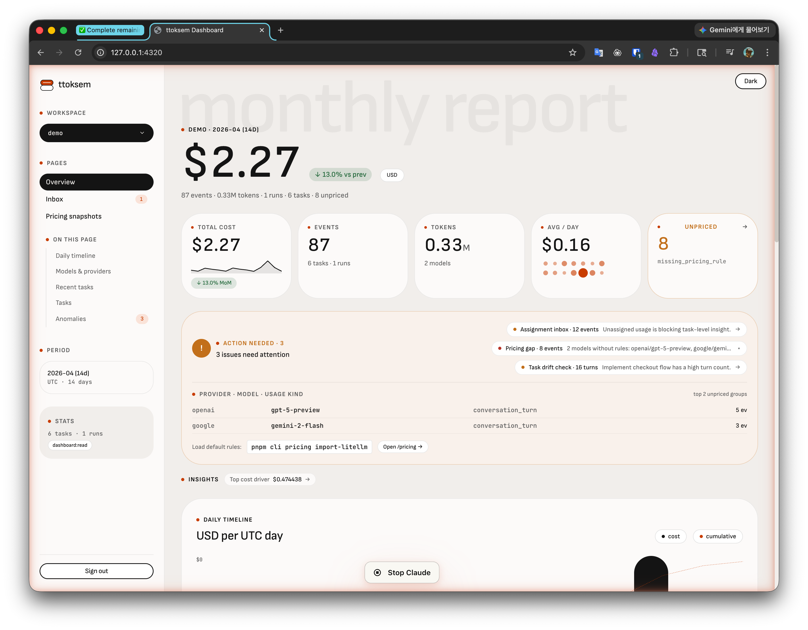
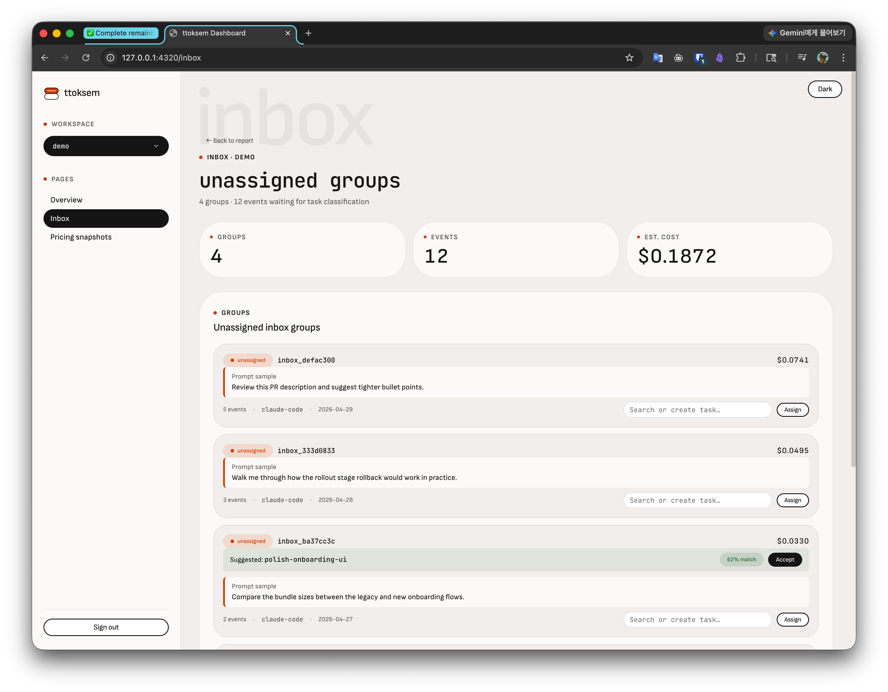
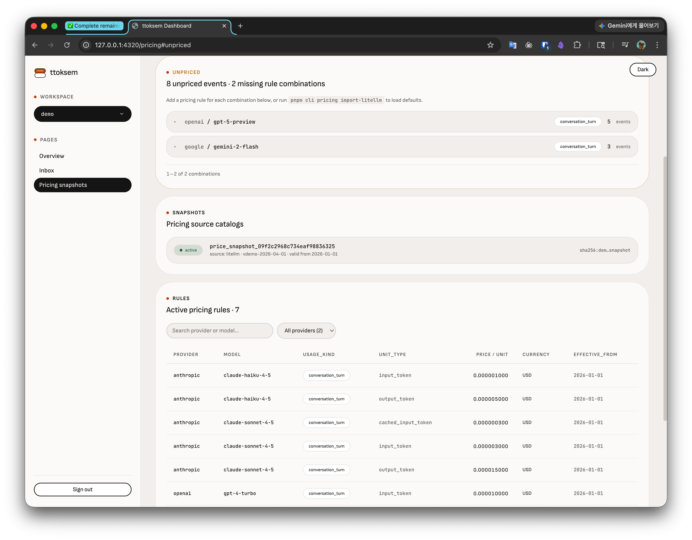
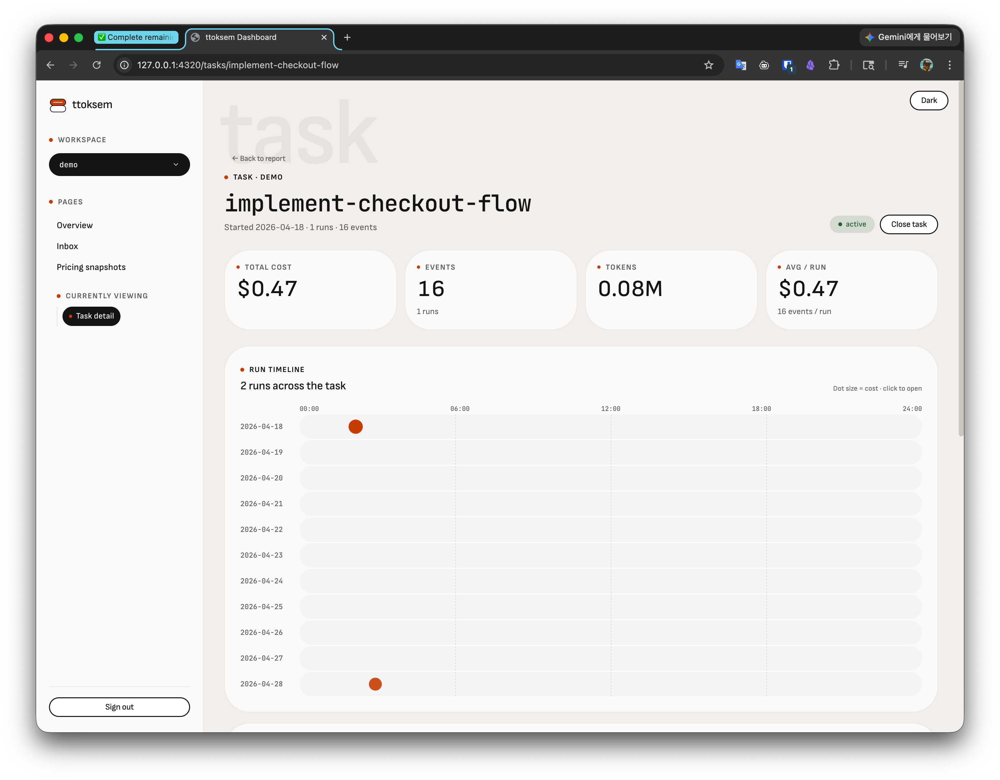
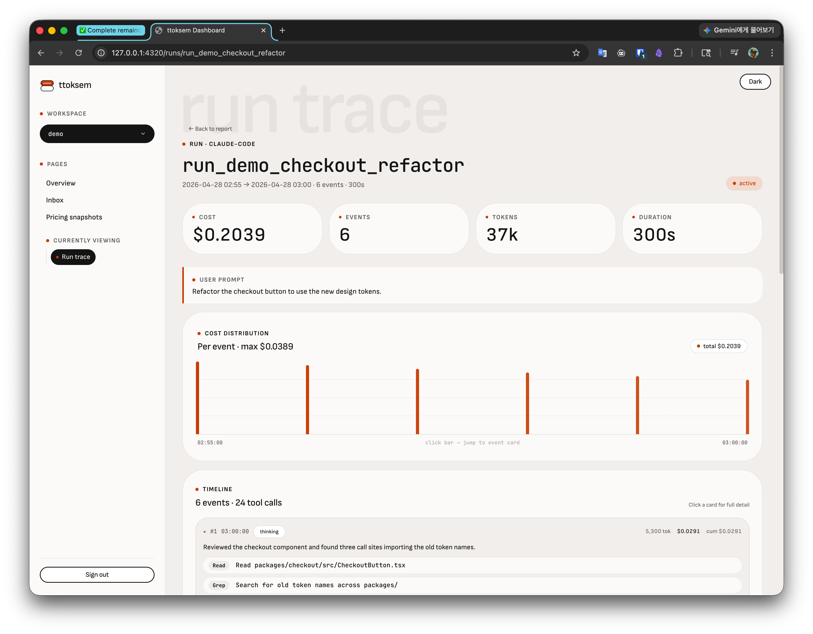

# ttoksem

A local-first cost ledger for AI usage. Records token spend per
workspace, task, run, and event from Claude Code, Codex, and OpenAI
SDK responses; prices it against versioned rule snapshots; and
surfaces it through a CLI and a local Hono dashboard.

The product records AI usage and cost. It does not execute LLM calls.

## What it does

- Imports token usage from Claude Code and Codex session logs, and from OpenAI SDK responses
- Attributes spend to a workspace, task, run, and event
- Prices usage against versioned pricing-rule snapshots
- Surfaces cost through CLI reports and a local dashboard
- Optional Cloudflare D1-backed Worker to share one ledger across machines

## Quick Start

Install the CLI (requires Node 22.5 or newer):

    npm install -g ttoksem

In a project where you use Claude Code, set it up:

    ttoksem init

`ttoksem init` creates a local ledger at `.ttoksem/ttoksem.db` and, with your
consent, installs a Claude Code Stop hook that captures token usage
automatically after every turn.

See your usage:

    ttoksem dashboard serve     # local web dashboard
    ttoksem report today        # today's cost in the terminal

## Self-hosting

To share one ledger across machines, self-host the D1-backed Worker on Cloudflare — see [docs/WORKER-D1.md](docs/WORKER-D1.md).

## Dashboard

`pnpm cli dashboard serve` boots a local Hono HTTP app that renders a
read-only dashboard with cookie-backed login. The same routes run on
the Cloudflare Worker entrypoint when deployed against D1.

### Overview (`/`)



Total cost, event/token totals, models breakdown, and a daily
timeline. The **Unpriced** KPI card shows events that don't yet match
a pricing rule and click-throughs to `/pricing#unpriced`. An **Action
needed** banner separates true todo items (Assignment inbox · Pricing
gap · Task drift) from informational **Insights** (top cost driver).
Recently active tasks and the cost-ranked task table both sit below.

### Inbox (`/inbox`)



Unassigned usage groups sorted by group id. Each group shows the
suggested task (when confident), a prompt sample, and inline
**Accept** / **Assign** actions. Assigning uses a searchable task
combobox that sorts by recency and offers a `+ Create '<key>' &
assign` row when the typed key doesn't exist yet — the server creates
the task on demand without making it active.

### Pricing (`/pricing`)



Loaded pricing source snapshots, the active rules table (filterable
by provider and free-text search), and an **Unpriced** section that
groups missing-rule events by `provider · model · usage_kind` so each
row maps cleanly to one pricing rule you might add. Rows expand to
show sample event ids and `unpriced_reason`.

### Task detail (`/tasks/:key`)



KPIs (total cost, events, tokens, avg per run), a 24h scatter run
timeline (dot size = cost), the paginated runs list, recent events,
and a per-event cost distribution chart with hover crosshair and
click-to-jump-to-card. Active tasks get a **Close task** button on
the header.

### Run detail (`/runs/:runId`)



Reconstructed trace of what the assistant actually did during the
run: text excerpts, tool calls (Bash, Edit, Read, Grep, etc.) with
per-tool input summaries, and thinking excerpts where present. Falls
back to a JSONL re-read for events imported before the
assistant-summary enrichment landed.

Read-only sessions (tokens with only `dashboard:read`) see the same
views but inbox/task write actions are disabled with a tooltip
pointing at the CLI to mint a wider key.

## Currency Policy

ttoksem keeps currency as provenance on cost-bearing usage records:

- `observed_currency`: currency reported with provider-observed cost
- `estimated_currency`: currency used for rule-estimated cost

ttoksem does not perform currency conversion, mixed-currency subtotaling, or primary-currency report selection.

In practice, most initial pricing data is expected to be USD. Reports should only show a single currency when all included cost rows use the same currency; mixed or missing currency rows should be surfaced as unknown or warning state instead of silently merged.

## Pricing Rule Policy

Pricing source snapshots record where a provider price catalog came from. Pricing rules are normalized rows imported from, or manually tied to, those snapshots. This keeps cost calculations auditable without parsing raw provider files during reports.

Snapshot metadata includes source name, source URL/version/commit, retrieval/bundle timestamps, `raw_sha256`, optional raw storage reference, and metadata JSON. Pricing rules can reference a snapshot through `source_snapshot_id`.

Pricing rules convert usage units into estimated cost when provider-observed cost is missing. Rules are scoped to a workspace and matched by:

```text
provider + model + usage_kind + unit_type + effective time
```

Supported unit types are intentionally string-based. Common values are:

```text
input_token
output_token
cached_input_token
cache_write_input_token
reasoning_output_token
audio_input_token
audio_output_token
total_token
request
second
image
```

If a matching rule exists, usage is stored with `pricing_mode=rule_calculated`, `estimated_cost_nanos`, `estimated_currency`, pricing rule ids, pricing source snapshot ids, and `cost_calculated_at`. If no matching rule exists, the usage remains `pricing_mode=unpriced` with `unpriced_reason=missing_pricing_rule`.

Existing unpriced events can be recalculated after rules are added with `pricing reprice`.
Existing `unpriced` and `rule_calculated` events can be migrated against the current active rules with `pricing migrate-events`. This updates the denormalized pricing projection columns while preserving the original ingest `payload_json` as evidence.

## Usage Timing Policy

`occurred_at` remains the canonical event time for ordering and reporting. Usage records may also carry optional execution timing:

- `started_at`: when the measured assistant/model work started
- `ended_at`: when that work ended
- `duration_ms`: elapsed time in milliseconds

If `started_at` and `ended_at` are present but `duration_ms` is omitted, the core service derives `duration_ms`. Missing timing fields are allowed so lightweight/manual logging stays simple.

Stored timestamps are UTC ISO text. The browser dashboard keeps those source values unchanged and applies the client's timezone only while rendering timestamps and daily dashboard buckets. CLI reports remain UTC-oriented unless a later reporting command adds an explicit timezone option.

## Prompt Retention Policy

`usage codex-turn`, `usage import-codex-sessions`, `usage claude-turn`, and `usage import-claude-sessions` default to `--prompt-mode full` for local Codex/Claude logging, because the task and run reports use prompt samples to explain where tokens were spent.

Sensitive workspaces can choose stricter modes:

```text
full      store prompt/response text as provided
redacted  store text after built-in secret, token, private-key, and email redaction
hash      store SHA-256 hashes in prompt_snapshot, not text
none      store no prompt_snapshot text or hash
```

Redacted mode also avoids copying the original Codex `user_message` into source context, so dashboard and inbox samples read from the sanitized prompt text. This redaction is a local safety net, not a DLP product; do not intentionally paste secrets into usage records.

## Run Policy

A run groups multiple usage events from one explicit request, job, or attempt.

Inputs do not require a session concept. For ordinary one-off usage records, omit run fields and record the usage directly to a task or inbox. When an integration needs to group several measurable events, pass an explicit `run_id`; the core service creates or reuses that run, stores its `run_id` on each usage event, and reconciles the run's start/end range from attached usage.

Usage can still be recorded without a run. That keeps one-off/manual logging simple while allowing RAG, API, and tool workflows to group related events when the caller has enough context.

## Access Key Policy

ttoksem does not model users, passwords, sessions, organizations, or RBAC in the MVP. Local CLI commands use the OS user boundary.

Dashboard/API data is protected by database access keys. Tokens are shown once, while only `token_hash` and `token_prefix` are stored. Read-only dashboard APIs require `dashboard:read`; HTTP mutation routes require `api:write`. A key can optionally be restricted to specific workspace keys.

See [docs/ACCESS-AUTH.md](docs/ACCESS-AUTH.md) for the current policy and commands.

## Project Shape

This repo is intentionally a pnpm workspace, not a single `src/` package.

The split is not mainly for public npm publishing. It exists to keep runtime boundaries visible while the implementation grows:

- `@ttoksem/schema`: shared validation and TypeScript types
- `@ttoksem/core`: runtime-neutral ledger behavior
- `@ttoksem/providers`: provider SDK response mappers
- `@ttoksem/storage`: storage interfaces
- `@ttoksem/storage-sqlite`: local SQLite adapter
- `@ttoksem/storage-d1`: Cloudflare D1 adapter for Worker deployments
- `@ttoksem/http`: Hono routes for local dashboard/API surfaces
- `@ttoksem/cli`: Node.js CLI entrypoint
- `@ttoksem/server`: local Node server entrypoint under `apps/server`
- `@ttoksem/worker`: Cloudflare Worker entrypoint under `apps/worker`

See [docs/ARCHITECTURE.md](docs/ARCHITECTURE.md) for the reasoning and execution model.

## Examples

- [Conversation Task Assignment](docs/examples/conversation-task-assignment.md): how a chat assistant should map a long conversation to task, run, and usage events without forcing the user to remember commands.
- [Access Key Auth](docs/ACCESS-AUTH.md): how local dashboard/API access is guarded without adding user accounts or RBAC.
- [Codex Session Import](docs/examples/codex-session-import.md): how Codex agents or local hooks should import Codex App/CLI `token_count` records from local session JSONL files.
- [Claude Code Session Import](docs/examples/claude-session-import.md): how Claude Code agents or local hooks should import `~/.claude/projects` session JSONL files, including multi-goal inbox flow and Anthropic pricing setup.
- [OpenAI SDK Collector](docs/examples/openai-sdk-collector.md): how to turn OpenAI SDK response usage into exact ttoksem usage events.
- [Worker D1 Deployment](docs/WORKER-D1.md): how the D1-backed Worker entrypoint is wired.
- [Token Estimation Examples](docs/examples/token-estimation.md): how an assistant should fill token counts and provenance when provider usage is missing.
- [Usage Event Taxonomy](docs/examples/usage-event-taxonomy.md): how to record RAG, API calls, tools, media, storage, and other measurable operations.

## Development

```bash
pnpm install
pnpm build
pnpm test
pnpm cli doctor
```

Use `TTOKSEM_DB=/path/to/ttoksem.db` to select a local SQLite file. Without it, the CLI uses `.ttoksem/ttoksem.db` in the current directory.

## Current CLI Slice

Discover commands and options interactively:

```bash
pnpm cli --help                  # top-level command groups
pnpm cli task --help             # subcommands under one group
pnpm cli task start --help       # arguments + options for a leaf command
pnpm cli help <command>          # equivalent to <command> --help
```

`--version` prints the CLI version. The pricing numbers below are example rules, not provider price guidance.

```bash
# Setup
pnpm cli workspace init --key ttoksem-dev --root .
pnpm cli workspace list
pnpm cli task start implement-chat-usage-logging --workspace ttoksem-dev
export TTOKSEM_TASK=implement-chat-usage-logging   # see "Shell-scoped active task" below

# Pricing setup
pnpm cli pricing snapshot upsert --id price_snapshot_example --source-name litellm --raw-sha256 sha256:example --source-commit example --valid-from 2026-01-01T00:00:00.000Z
pnpm cli pricing import-litellm --workspace ttoksem-dev --source-snapshot-id price_snapshot_example --file .ttoksem/pricing-snapshots/litellm-model-prices.json
pnpm cli pricing upsert --workspace ttoksem-dev --source-snapshot-id price_snapshot_example --provider openai --model codex-chat --usage-kind conversation_turn --unit-type input_token --price 0.10 --per 1000000 --effective-from 2026-01-01T00:00:00.000Z
pnpm cli pricing upsert --workspace ttoksem-dev --source-snapshot-id price_snapshot_example --provider openai --model codex-chat --usage-kind conversation_turn --unit-type output_token --price 0.50 --per 1000000 --effective-from 2026-01-01T00:00:00.000Z

# Usage ingest (Codex / Claude / OpenAI)
pnpm cli usage codex-turn --workspace ttoksem-dev --task implement-chat-usage-logging --started-at 2026-04-27T05:00:00.000Z --ended-at 2026-04-27T05:00:03.000Z
pnpm cli usage openai-response --workspace ttoksem-dev --task implement-chat-usage-logging --file ./openai-response.json --operation chat.completions.create
pnpm cli usage import-codex-sessions --workspace ttoksem-dev --task implement-chat-usage-logging --thread-id <codex_thread_id> --model gpt-5.5 --dry-run
pnpm cli usage import-codex-sessions --workspace ttoksem-dev --task implement-chat-usage-logging --thread-id <codex_thread_id> --model gpt-5.5
pnpm cli usage claude-turn --workspace ttoksem-dev --task implement-chat-usage-logging --prompt-text "manual claude turn" --input-chars 80 --output-chars 200
pnpm cli usage import-claude-sessions --workspace ttoksem-dev --task implement-chat-usage-logging --dry-run
pnpm cli usage import-claude-sessions --workspace ttoksem-dev --task implement-chat-usage-logging

# Maintenance
pnpm cli pricing reprice --workspace ttoksem-dev
pnpm cli pricing migrate-events --workspace ttoksem-dev

# Auth + access keys
pnpm cli auth key create --name "hwanghee dashboard" --scope dashboard:read
pnpm cli auth key create --name "http writer" --scope api:write --workspace-scope ttoksem-dev

# Inbox
pnpm cli inbox list --workspace ttoksem-dev
pnpm cli inbox show <inbox_group_id> --workspace ttoksem-dev
pnpm cli inbox accept <inbox_group_id> --workspace ttoksem-dev --all
pnpm cli inbox assign <inbox_group_id> --workspace ttoksem-dev --task implement-chat-usage-logging --all
pnpm cli inbox assign-event <usage_id> --workspace ttoksem-dev --task implement-chat-usage-logging

# Reports + dashboard
pnpm cli report today --workspace ttoksem-dev
pnpm cli report task implement-chat-usage-logging --workspace ttoksem-dev
pnpm cli dashboard serve --workspace ttoksem-dev --port 4317

# Wrap up
pnpm cli task archive implement-chat-usage-logging --workspace ttoksem-dev
unset TTOKSEM_TASK
```

If `usage codex-turn` / `usage claude-turn` / `usage import-*-sessions` is recorded without `--task` (and `$TTOKSEM_TASK` is unset), the event remains unassigned and appears in `inbox list`. The default inbox view is group-based; use `inbox list --events` for the raw event list.

For Codex/Claude-agent workflows, `usage import-codex-sessions` and `usage import-claude-sessions` are intended to be called by the agent, skill, or local hook as part of the work loop. The user should not need to run the import command manually after each request.

### Shell-scoped active task (`TTOKSEM_TASK`)

The autocapture Stop hook reads `$TTOKSEM_TASK` directly. When set, imported events are attributed to that task; when unset, events fall through to the inbox for later classification via `pnpm cli inbox accept`. Because the variable is shell-scoped, two terminals can each have their own active task without collision.

`pnpm cli task start <key>` prints a stderr hint suggesting the matching `export TTOKSEM_TASK=<key>` line, so you don't have to remember to copy the key by hand.

### Renamed and deprecated commands

- `task close` is renamed to `task archive`. The old name still works but prints a deprecation banner; it will be removed on `2026-11-07`.
- `task active` is deprecated on the same timeline. Use `echo $TTOKSEM_TASK` to read the current shell-scoped task, or `task list` to see tasks with `status='active'` in the ledger.
- `closeTask({ workspace })` (no key) is removed: `key` is now required. Pass the task key explicitly or use `task archive <key>`.

See [MIGRATION.md](MIGRATION.md) for full sunset timeline and rollback notes.

### Remote mode

The CLI can talk to a running ttoksem server instead of the local SQLite DB. Set `TTOKSEM_HTTP_URL` (and `TTOKSEM_HTTP_TOKEN` if the server enforces auth) before invoking the CLI:

```bash
export TTOKSEM_HTTP_URL=https://ledger.example.com
export TTOKSEM_HTTP_TOKEN=ttoksem_live_…
pnpm cli task list --workspace ttoksem-dev
```

Subcommands needing admin or filesystem capabilities (`workspace init`/`current`, `auth key *`, `pricing snapshot/rule upsert`, `pricing import-litellm`, `pricing reprice`, `pricing migrate-events`, `usage codex-turn`/`claude-turn`/`import-*-sessions`/`openai-response`/`anthropic-response`, `dashboard serve`, `doctor`) hard-error in remote mode with a clear "requires local DB" message.

See [docs/REMOTE-MODE.md](docs/REMOTE-MODE.md) for the env vars, supported subcommand list, error mapping, and limitations.
